# Clash Fleet 架构可行性调研报告 (Architecture Survey)

- **调研角色**: Browser Lead & Agentic Team
- **文档状态**: 调研成果持久化沉淀 (Durable Research Artifact)
- **基准提交**: `main @ 820481db0b47bb58ac14f5f6af2e697316799be3`
- **日期**: 2026-09-30

---

## 1. 背景与调研目标

Clash Fleet 的目标是为基于 Clash Verge Rev (以下简称 CVR) 与 Mihomo (原 Clash.Meta) 内核的用户环境，构建跨设备（macOS / Windows 等）的高可用、自动化配置分发、部署与诊断工具链。

在进入正式工程实现与详细规格（Spec）设计前，必须针对 CVR 内部运行机制、Mihomo 内核接口、以及现有规则/分流生态的成熟分发链路进行深度调研，理清确定性技术事实（Verified）、架构推论（Inferred）以及需要原型验证的关键门禁（Unresolved Prototype Gates）。

---

## 2. 结论分级与分类体系 (Taxonomy)

本调研严格区分三类结论：

- **Verified (已核实事实)**：经官方文档、源码实现或确定性测试直接证明的事实，作为架构硬边界；
- **Inferred (推荐架构假说/推论)**：在已验证事实基础上，综合多设备维护与运维可靠性推演出的设计假说；
- **Unresolved (未决原型验证门禁)**：直接影响下游工程选型的关键未知点，必须在进入正式产品实现前通过隔离原型（Prototype）验证并建立 Gate。

---

## 3. 已核实事实 (Verified Findings)

### 3.1 Clash Verge Rev 扩展脚本运行时与执行机制
1. **脚本运行时与入口**:
   - CVR 的全局扩展脚本与订阅扩展脚本运行于 Rust 嵌入式 JavaScript 引擎 **Boa**（ECMAScript 2019 子集）。
   - 脚本标准执行入口函数签名固定为 `function main(config, profileName) { return config; }`。
2. **I/O 边界与沙箱限制**:
   - CVR 官方文档与实现明确声明：扩展脚本运行在无原生 I/O 沙箱环境中，**不支持任何网络 I/O (`fetch`/`http`) 与文件系统 I/O (`fs`)**。
3. **脚本输入方式**:
   - CVR 在执行配置生成时，将用户配置的整个脚本文本作为单一的 Source Code 字符串载入 Boa 引擎执行，不存在运行时的多文件动态 `import`/`require` 模块系统。
4. **控制面权威覆盖 (App-owned authoritative fields)**:
   - CVR 存在应用层权威控制字段（如系统代理开关、TUN 模式配置、DNS 劫持注入、监听端口等）。
   - 扩展脚本（Script）或 Merge 配置对这些权威控制字段的修改，会在 CVR 最终配置组装流水线的末端被用户 UI 的全局设置（Settings / App State）覆盖。
5. **配置保存与热应用路径**:
   - CVR 后端自身的 `save_profile_file`（及相关订阅/脚本保存）调用链包含了脚本语法校验（Script Validation）、运行时应用（Runtime Apply）、失败自动回滚与备份（Backup / Recovery）行为。

### 3.2 Mihomo 内核控制面与规则体系
1. **Rule Provider 原生支持**:
   - Mihomo 原生支持 `rule-providers` 机制，允许以独立文件或远程 URL 的形式挂载 `domain`、`ipcidr`、`classical` 格式的大型规则集，内核负责异步更新与本地缓存。
2. **External Controller 运行态管理**:
   - Mihomo 暴露 RESTful 外部控制接口（External Controller API），其 `/configs` 端点支持通过 HTTP `GET` 查询内核当前运行态配置，并通过 `PUT` / `PATCH` 动态热重载（Reload）内核配置文件。

### 3.3 业界主流生态项目的构建与分发模式
1. **Loyalsoldier/clash-rules**:
   - 采用 GitHub Actions CI 定时与触发式拉取上游数据，生成不可变的规则构件（Artifacts），并通过 GitHub Releases 与固定的 release 分支提供 CDN 加速的分发服务。
2. **sub-store-org/Sub-Store**:
   - 采用 `build → test → bundle → release` 的严密流水线，将跨平台业务逻辑打包为单体产物发布至 GitHub Release / release 分支，并构建了完善的构件同步与版本校验机制。
3. **blackmatrix7/ios_rule_script & ACL4SSR**:
   - 证实了“精细规则解耦为分模块 Provider”、“主脚本/主配置保持骨架轻量、细规则交由 Provider 托管”是保障维护性与性能的工业标准实践。
4. **tindy2013/subconverter & juewuy/ShellCrash**:
   - 证明了多端配置同步必须具备“本地兜底机制”与“不可变配置回滚保护”，任何网络断流均不可破坏已有可用代理栈。

---

## 4. 推荐架构假说 (Recommended Architecture Hypothesis)

基于上述已核实事实，Clash Fleet 推荐采用以下架构流水线假说：

$$\text{Modular Source} \xrightarrow{\text{Build}} \text{Single Script.js + Rule Assets} \xrightarrow{\text{Release}} \text{Immutable GitHub Release} \xrightarrow{\text{Deploy}} \text{Device Pull (Backup/Validate/Apply/Verify/Rollback)}$$

```mermaid
flowchart LR
    subgraph Repo["Source Repository (Git)"]
        Src["Modular JS Sources\n(Rule Engine, Presets)"]
        Rules["Rule Provider Specs\n(Domains, CIDRs)"]
    end

    subgraph CI["CI Pipeline (GitHub Actions)"]
        Build["Build & Lint\n(Generate Single Script.js)"]
        Test["Boa / Runtime Smoke Test"]
        Pack["Bundle Release Assets"]
    end

    subgraph Release["Distribution Authority"]
        GHRelease["Immutable GitHub Release\n(Versioned Tar/Zip & SHA256)"]
    end

    subgraph Device["Client Node (macOS / Windows)"]
        Pull["OS Adapter Puller"]
        Safe["Backup & Pre-flight Validation"]
        Apply["Apply to CVR profiles/Script.js"]
        Verify["Mihomo / CVR Health Verify"]
        Rollback["Auto-Rollback on Failure"]
    end

    Src --> Build
    Rules --> Build
    Build --> Test --> Pack --> GHRelease
    GHRelease --> Pull --> Safe --> Apply --> Verify
    Verify -- Failed --> Rollback
```

### 4.1 架构设计原则与边界
1. **职责分离 (Separation of Concerns)**:
   - **JavaScript 模块**: 专注处理分流策略编排、策略组拓扑计算（Tier 1 意图层、Tier 1.5 优选层、Tier 2 地区池）、节点过滤与动态补丁逻辑。
   - **Mihomo Rule Provider**: 托管海量域名、IP-CIDR 等大型数据集，减轻 JS 运行时解析开销与内存占用。
   - **OS Adapter**: 负责 macOS 与 Windows 本地文件路径适配、部署动作调度与本地网络可用性诊断。
2. **共享分流策略核心 (Shared Routing Policy)**:
   - 跨设备的路由规则与策略逻辑是一致的，**严禁将核心规则策略硬编码或复制拆分为 Mac 和 Windows 两套独立代码**。系统差异仅允许存在于适配层与本地控制面。
3. **不可变发布源 (Release Authority)**:
   - 正式分发倾向于以 **GitHub Release（具备固定语义化版本号与哈希校验）** 作为权威交付源，保证构件的可追溯性与不可变性。
   - **明确排除项**: Gist、可变 Raw Git 分支（mutable raw branch）或直接在设备上 `git pull` 源码均**不**作为 V1 生产级部署的核心机制。
4. **外部控制器定位 (External Controller Positioning)**:
   - Mihomo External Controller API 仅定位为**可选增强（Optional Enhancement）**（用于状态诊断、测速或轻量状态观测），**绝不作为 V1 部署的核心硬性依赖**。
5. **安全与机密边界 (Security Boundary)**:
   - **公开仓库红线**: 公共仓库中严禁存放任何个人订阅 URL、Token、API Key、Cookie 或特定设备私钥凭据。

---

## 5. 未决原型验证门禁 (Unresolved Prototype Gates)

在进入任何产品实现或架构固化之前，必须在独立的原型工作流中完成以下两个 Gate 的验证与评估：

### Gate A: 构建门禁 (Build Gate)
- **目标**: 验证如何将拆分为多个模块的 JavaScript 源码可靠地生成为一个符合 Boa 引擎语法规范（ES2019 子集、无非法内置函数依赖）、且带有全局 `main(config, profileName)` 入口的单体 `Script.js`。
- **验证重点**:
  - 产物在语法和行为上必须能够被真实 CVR / Boa 环境无缝解析和执行；
  - 评估不同构建方案（例如自定义极简串联脚本、esbuild、Rollup 等）的复杂度与产物体积；
  - **红线**: 在此 Gate 获得事实数据验证前，**不要提前冻结或偏向任何特定打包工具**。

### Gate B: 部署与生效门禁 (Deploy Gate)
- **目标**: 验证外部适配器在替换 CVR 运行目录下的 `profiles/Script.js`（或对应 Profile 文件）后，CVR 真实的生效与重载逻辑。
- **验证重点**:
  - 替换文件后，CVR 是否会自动感知并重新应用？是否需要通过特定 IPC、重启应用，还是切换当前选中 Profile 才能触发脚本重新执行？
  - 如果新脚本存在隐蔽语法错误或运行时异常，CVR 的崩溃回滚和日志呈现机制为何？
  - **核心警惕**: **绝对不能主观假设“向 Mihomo 内核发送 `/configs` reload 请求”等同于“CVR 重新执行了扩展脚本”**。Mihomo 仅重载配置文本，而配置文本是由 CVR 执行脚本后输出的，两者的触发点完全不同。

---

## 6. 核心一手参考与文献 (Primary Sources & References)

本调研所依赖的一手项目与官方资源：

1. **Clash Verge Rev 源码与文档**:
   - 官方仓库: [`clash-verge-rev/clash-verge-rev`](https://github.com/clash-verge-rev/clash-verge-rev)
   - 官方文档: [Clash Verge Rev Documentation](https://clash-verge-rev.github.io/)
2. **Mihomo (Clash Meta) 内核**:
   - 官方文档与配置规范: [Mihomo Wiki / Docs](https://wiki.metacubex.one/)
3. **工业级规则与构建生态**:
   - [`Loyalsoldier/clash-rules`](https://github.com/Loyalsoldier/clash-rules): GitHub Actions 产物生成与 Release 发布架构
   - [`sub-store-org/Sub-Store`](https://github.com/sub-store-org/Sub-Store): 订阅管理系统的 bundle 与发布同步范式
   - [`blackmatrix7/ios_rule_script`](https://github.com/blackmatrix7/ios_rule_script): 大规模规则分类与模块化 Provider 编排
   - [`ACL4SSR/ACL4SSR`](https://github.com/ACL4SSR/ACL4SSR): 规则集路由设计模式
4. **转换器与跨设备客户端系统**:
   - [`tindy2013/subconverter`](https://github.com/tindy2013/subconverter): 规则转换与多节点拓扑过滤
   - [`juewuy/ShellCrash`](https://github.com/juewuy/ShellCrash): 纯终端环境的配置热替换、备份与回滚机制
