# Clash Fleet 架构可行性调研报告 (Architecture Survey)

- **调研角色**: Browser Lead & Agentic Team
- **文档状态**: 调研成果持久化沉淀 (Durable Research Artifact - Revised)
- **基准提交**: `main @ 820481db0b47bb58ac14f5f6af2e697316799be3`
- **日期**: 2026-09-30

---

## 1. 背景与调研目标

Clash Fleet 的目标是为基于 Clash Verge Rev (以下简称 CVR) 与 Mihomo (原 Clash.Meta) 内核的用户环境，构建跨设备（macOS / Windows 等）的高可用、自动化配置分发、部署与诊断工具链。

在进入正式工程实现与详细规格（Spec）设计前，必须针对 CVR 内部运行机制、Mihomo 内核接口、以及现有规则/分流生态项目的分发链路进行深度调研，理清确定性技术事实（Verified）、架构推论与候选策略（Inferred）、以及需要原型验证的关键门禁（Unresolved Prototype Gates）。

---

## 2. 结论分级与分类体系 (Taxonomy)

本调研严格区分三类结论：

- **Verified (已核实事实)**：经官方文档、源码实现或确定性测试直接证明的事实，附带一手源码及文档指针（Primary-Source Pointers），作为架构硬边界；
- **Inferred (推荐架构假说与候选策略)**：在已验证事实基础上，综合多设备维护与运维可靠性推演出的设计假说；
- **Unresolved (未决原型验证门禁)**：直接影响下游工程选型的关键未知点，必须在进入正式产品实现前通过隔离原型（Prototype）验证并建立 Gate。

---

## 3. 已核实事实 (Verified Findings)

### 3.1 Clash Verge Rev 扩展脚本运行时与执行机制
1. **脚本运行时引擎与版本锚定**:
   - CVR 扩展脚本运行于 Rust 嵌入式 JavaScript 引擎 **Boa**。
   - CVR 当前开发主线源码中显式锁定依赖版本为 `boa_engine = "0.22.0"`。Clash Fleet 不自行预设或假定固定的 ECMAScript 年代规范（如 ES2019/ES2020 等）；具体的 JavaScript 语言特性与标准 API 兼容边界，由 Build Gate 针对实际 CVR-pinned Boa runtime 进行验证。
   - *一手源码参考*: [CVR `src-tauri/Cargo.toml`](https://github.com/clash-verge-rev/clash-verge-rev/blob/main/src-tauri/Cargo.toml)
2. **Callable Global `main` 入口合约**:
   - CVR 源码的脚本校验器（Validator）接受 `function main`、`const main` 或 `let main` 声明，并在底层执行层调用 `main(config, profileName)`。
   - **Verified Contract**: 最终交付的 Script 必须在全局作用域暴露可调用的 `main(config, profileName)` 函数。
   - *一手源码参考*: [CVR `src-tauri/src/core/validate.rs`](https://github.com/clash-verge-rev/clash-verge-rev/blob/main/src-tauri/src/core/validate.rs)、[CVR `src-tauri/src/enhance/script.rs`](https://github.com/clash-verge-rev/clash-verge-rev/blob/main/src-tauri/src/enhance/script.rs)
3. **I/O 边界与沙箱限制**:
   - CVR 扩展脚本运行在无外部 I/O 绑定的沙箱中，**不支持网络 I/O (`fetch`/`http`) 与文件系统 I/O (`fs`)**。
   - *一手文档参考*: [Clash Verge Rev 官方扩展脚本文档](https://clash-verge-rev.github.io/guide/extension.html)
4. **单源文本执行与无运行时多文件 Loader**:
   - CVR 当前的扩展脚本执行路径将单一脚本源码文本（script source text）传递给 Boa 引擎执行评估，并未提供应用层/项目级的多文件加载器或 CommonJS `require` 规范支持。
   - 因此，**Clash Fleet 不依赖运行时动态多文件加载**；多源码文件解耦依赖构建期打包（Build-time Bundling），由 Build Gate 进行验证。
   - *一手源码参考*: [CVR `src-tauri/src/enhance/script.rs`](https://github.com/clash-verge-rev/clash-verge-rev/blob/main/src-tauri/src/enhance/script.rs)
5. **App-owned Authoritative 控制面字段**:
   - 根据 CVR 源码实现，应用层存在一组明确的权威控制面字段（Authoritative / Control-Plane Fields），包括：
     - `CONTROL_PLANE_KEYS` 常量定义的字段；
     - GUI 管理选定的 `tun` 字段；
     - 应用接管的 `dns` 字段；
     - `hosts` 映射。
   - Script 或 Merge 对上述控制面字段的修改，会在最终配置组装流水线的末端被应用自身设置（App State / GUI Settings）覆盖。
   - **分层边界确认**: 上述 CVR 应用内部控制面字段与操作系统层面的系统代理开关（OS system proxy）属于完全不同的控制层级。
   - *一手源码参考*: [CVR `src-tauri/src/enhance/mod.rs`](https://github.com/clash-verge-rev/clash-verge-rev/blob/main/src-tauri/src/enhance/mod.rs)
6. **配置保存、恢复与自动备份行为**:
   - **失败恢复 (Rollback)**: `save_profile_file` 在脚本校验（Validation）或运行时应用（Runtime Apply）失败时，会触发恢复原始文件的逻辑，防止损坏配置落地。
   - **自动备份 (AutoBackup)**: 自动备份触发逻辑在当前 CVR 源码中是明确展示并限定应用于全局 `Merge` / `Script` 配置保存流程，而非泛化应用于所有类型的 profile/script 保存动作。
   - *一手源码参考*: [CVR `src-tauri/src/cmd/save_profile.rs`](https://github.com/clash-verge-rev/clash-verge-rev/blob/main/src-tauri/src/cmd/save_profile.rs)、[CVR `src/locales/en/profiles.json`](https://github.com/clash-verge-rev/clash-verge-rev/blob/main/src/locales/en/profiles.json)

### 3.2 Mihomo 内核控制面与规则体系
1. **Rule Provider 原生支持**:
   - Mihomo 原生支持 `rule-providers` 机制，支持挂载 `domain`、`ipcidr`、`classical` 格式的外部规则集文件或远程链接，内核负责异步更新与本地缓存匹配。
   - *一手文档参考*: [Mihomo 官方 Rule Providers 文档](https://wiki.metacubex.one/config/rule-providers/)
2. **External Controller 运行态管理**:
   - Mihomo 暴露 RESTful 外部控制接口，其 `/configs` 端点支持通过 HTTP `GET` 查询内核当前运行态配置，并通过 `PUT` / `PATCH` 动态热重载（Reload）内核配置文件。
   - *一手文档参考*: [Mihomo 官方 API /configs 文档](https://wiki.metacubex.one/api/#configs)

### 3.3 业界高使用量生态项目的构建与分发模式
高使用量开源项目展示了可供借鉴的 `source → transform/build → artifact → distribution` 模式：
1. **Loyalsoldier/clash-rules**:
   - 使用 GitHub Actions CI 拉取上游原始数据并生成规则文件构件，发布到 GitHub Release 及发布分支。
   - *一手源码参考*: [Loyalsoldier `/.github/workflows/run.yml`](https://github.com/Loyalsoldier/clash-rules/blob/release/.github/workflows/run.yml)
2. **sub-store-org/Sub-Store**:
   - 使用 `build → test → bundle` 流水线构建出单体运行构件，发布至 GitHub Release 及 release 分支，并提供构件同步机制。
   - *一手源码参考*: [Sub-Store `/.github/workflows/main.yml`](https://github.com/sub-store-org/Sub-Store/blob/master/.github/workflows/main.yml)
3. **blackmatrix7/ios_rule_script, ACL4SSR, tindy2013/subconverter, juewuy/ShellCrash**:
   - 展示了规则集切片拆分、模板化配置以及跨设备本地分发的可选设计路径。其具体做法是否采纳属于 Clash Fleet 架构假说，需经工程评审确定。

---

## 4. 推荐架构假说与候选策略 (Recommended Architecture Hypothesis)

基于上述已核实事实，Clash Fleet 建议采用以下架构流水线假说：

$$\text{Modular Source} \xrightarrow{\text{Build}} \text{Single Script.js + Rule Assets} \xrightarrow{\text{Release Candidate}} \text{Versioned GH Release + Checksums} \xrightarrow{\text{Deploy}} \text{Device Pull (Backup/Validate/Apply/Verify/Rollback)}$$

```mermaid
flowchart LR
    subgraph Repo["Source Repository (Git)"]
        Src["Modular JS Sources\n(Rule Engine, Presets)"]
        Rules["Rule Provider Specs\n(Domains, CIDRs)"]
    end

    subgraph CI["CI Pipeline (GitHub Actions)"]
        Build["Build & Lint\n(Generate Single Script.js)"]
        Test["Boa (0.22.0) Runtime Smoke Test"]
        Pack["Bundle Release Assets & Generate Checksums"]
    end

    subgraph Release["Distribution Authority (Candidate Policy)"]
        GHRelease["Versioned GitHub Release + Checksums\n(Enforced/Verified Immutability Policy)"]
    end

    subgraph Device["Client Node (macOS / Windows)"]
        Pull["OS Adapter Puller"]
        Safe["Backup & Pre-flight Validation"]
        Apply["Apply to CVR profiles/Script.js"]
        Verify["Mihomo / CVR Health Verify"]
        Rollback["Auto-Rollback on Failure"]
    end

    Src --> Build
    Rules --> Build
    Build --> Test --> Pack --> GHRelease
    GHRelease --> Pull --> Safe --> Apply --> Verify
    Verify -- Failed --> Rollback
```

### 4.1 架构设计原则与边界
1. **职责分离 (Separation of Concerns)**:
   - **JavaScript 模块**: 专注处理分流策略编排、策略组拓扑构建、节点正则匹配过滤与配置修补逻辑。
   - **Mihomo Rule Provider**: 承载海量域名与 IP-CIDR 数据集，避免单体脚本过大导致 Boa 内存与解析开销。
   - **OS Adapter**: 负责 macOS 与 Windows 本地路径映射、客户端部署调度与环境健康状态诊断。
2. **共享分流策略核心 (Shared Routing Policy)**:
   - 跨设备的路由规则与策略编排保持统一，**严禁将共享路由策略复制为 Mac 和 Windows 两套独立实现**。系统差异仅允许隔离在本地适配器层。
3. **候选分发权威策略 (Candidate Release Authority Policy)**:
   - 生产级分发倾向于采用 **`Versioned GitHub Release + checksums + enforced/verified immutability policy`**。
   - **具体 Release 不可变性强制机制 (Immutable Release Enforcement)** 留待后续专项目标的 release-design gate 进行决策与设计。
   - **明确排除项**: Gist、可变 Raw Git 分支（mutable raw branch）或直接在设备客户端执行 `git pull` 源码均**不**作为 V1 生产部署的核心机制。
4. **外部控制器定位 (External Controller Positioning)**:
   - Mihomo External Controller API 定位为**可选增强（Optional Enhancement）**（用于状态诊断、节点连通性观测），**不作为 V1 部署的核心硬依赖**。
5. **安全与机密边界 (Security Boundary)**:
   - **公开仓库红线**: 公共仓库中严禁持久化保存任何个人订阅 URL、Token、API Key、Cookie 或设备私钥凭证。

---

## 5. 未决原型验证门禁 (Unresolved Prototype Gates)

在进入具体产品实现或冻结打包方案前，必须在独立的原型工作流中完成以下两个 Gate 的验证：

### Gate A: 构建门禁 (Build Gate)
- **目标**: 验证拆分为多个源码模块的 JavaScript 代码库如何可靠生成符合 **CVR 锁定的 Boa 运行时 (`boa_engine = 0.22.0`) 语法与标准库边界**、且暴露 callable global `main(config, profileName)` 入口的单体 `Script.js`。
- **验证重点**:
  - 产物在语法和行为上必须能够通过 CVR 源码级校验器（`validate.rs`）并被实际 Boa 运行时正确执行；
  - 探索不同构建手段（极简串联拼装、esbuild、Rollup 等）的可行性；
  - **原则**: 在获得实际测试数据前，**严禁提前冻结任何特定 bundler 工具链**。

### Gate B: 部署与生效门禁 (Deploy Gate)
- **目标**: 验证外部适配器在替换 CVR 运行目录下的 `profiles/Script.js`（或对应配置）后，CVR 真实的生效与重载逻辑。
- **验证重点**:
  - 外部替换文件后，CVR 是否自动感知？是否需要重启应用、重新触发 profile 切换或调用特定界面逻辑才能触发脚本重新执行？
  - 遇到脚本执行异常时 CVR 的错误呈现机制与恢复边界；
  - **核心警惕**: **绝对不能主观假设“向 Mihomo 内核发送 `/configs` reload 请求”等同于“CVR 重新执行了扩展脚本”**。Mihomo 仅重载最终配置 YAML，而该 YAML 是由 CVR 执行脚本后输出的，两者的触发点完全不同。

---

## 6. 核心一手参考与文献 (Primary Sources & References)

1. **Clash Verge Rev 源码与文档**:
   - 依赖版本: [CVR `src-tauri/Cargo.toml`](https://github.com/clash-verge-rev/clash-verge-rev/blob/main/src-tauri/Cargo.toml)
   - 脚本校验: [CVR `src-tauri/src/core/validate.rs`](https://github.com/clash-verge-rev/clash-verge-rev/blob/main/src-tauri/src/core/validate.rs)
   - 脚本执行: [CVR `src-tauri/src/enhance/script.rs`](https://github.com/clash-verge-rev/clash-verge-rev/blob/main/src-tauri/src/enhance/script.rs)
   - 控制面字段: [CVR `src-tauri/src/enhance/mod.rs`](https://github.com/clash-verge-rev/clash-verge-rev/blob/main/src-tauri/src/enhance/mod.rs)
   - 配置保存与恢复: [CVR `src-tauri/src/cmd/save_profile.rs`](https://github.com/clash-verge-rev/clash-verge-rev/blob/main/src-tauri/src/cmd/save_profile.rs)
   - 国际化文案及备份触发定义: [CVR `src/locales/en/profiles.json`](https://github.com/clash-verge-rev/clash-verge-rev/blob/main/src/locales/en/profiles.json)
   - 官方文档: [Clash Verge Rev Documentation](https://clash-verge-rev.github.io/guide/extension.html)
2. **Mihomo (Clash Meta) 内核**:
   - 规则集格式: [Mihomo Wiki Rule Providers](https://wiki.metacubex.one/config/rule-providers/)
   - 内核 API: [Mihomo Wiki API /configs](https://wiki.metacubex.one/api/#configs)
3. **业界构建流水线项目**:
   - 规则构建工作流: [Loyalsoldier `/.github/workflows/run.yml`](https://github.com/Loyalsoldier/clash-rules/blob/release/.github/workflows/run.yml)
   - 订阅转换打包流水线: [Sub-Store `/.github/workflows/main.yml`](https://github.com/sub-store-org/Sub-Store/blob/master/.github/workflows/main.yml)
