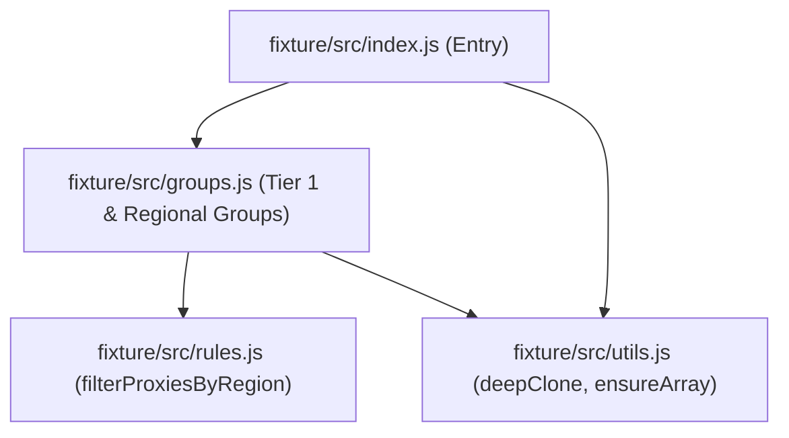

# Clash Fleet — Gate A 构建门禁调研与实验验证报告 (Gate A Build Findings)

- **调研角色**: Browser Lead & Agentic Team
- **文档状态**: Gate A 原型实验结果持久化沉淀 (Gate A Verified Findings)
- **基准提交**: `main @ 77672466e01b01ac96650b88c71032440f0bf184`
- **原型分支**: `prototype/build-gate`
- **日期**: 2026-09-30

---

## 1. 核心问题与实验目标

在 Clash Fleet 架构流水线中，JavaScript 分流与编排逻辑需解耦为模块化源码仓库进行敏捷维护，但最终交付至客户端时，必须受限于 Clash Verge Rev (CVR) 的执行机制：

> **核心问题**: 多个模块化 JavaScript 源文件，怎样最简单可靠地生成一个 Clash Verge Rev 可以实际执行的单一 `Script.js`？

本实验建立最小、隔离、完全可重复的自动化原型环境，针对真实的 `boa_engine = 0.22.0` 执行产物，取得可被完全验证的一手运行数据。

---

## 2. Clash Verge Rev 运行时一手事实与合约边界

经核实 CVR 主线一手源码，确认以下三项运行时硬边界：

### 2.1 脚本静态校验合约 (`validate.rs`)
CVR 在导入或保存脚本时，由 `src-tauri/src/core/validate.rs` 执行预检：
1. **字符串硬检查**:
   ```rust
   let has_main = content.contains("function main") ||
                  content.contains("const main") ||
                  content.contains("let main");
   ```
   **若源码未字面量包含上述三种声明之一，直接拦截并报错**: `"Script must contain a main function"`。
2. **Boa 0.22.0 语法解析**:
   在独立的 Boa Context 中通过 `eval` 进行语法树解析，任何未捕获的语法错误（如顶层 `export`/`import`）均会导致校验失败。

### 2.2 脚本运行时调用合约 (`script.rs`)
CVR 在配置组装流水线 `src-tauri/src/enhance/script.rs` 中执行脚本：
```rust
let code = format!(
    r"try{{
    {script};
    JSON.stringify(main(JSON.parse(globalThis.__verge_config__),'{safe_name}')||'')
  }} catch(err) {{
    `__error_flag__ ${{err.toString()}}`
  }}"
);
```
- **全局直接可调用**: 执行时直接在全局作用域调用 `main(config, profileName)`；若被闭包隔离在 IIFE 内部未暴露，将引发 `TypeError: Callable global 'main' is not defined`。
- **无内置模块加载器**: 运行时仅接受单一 script 文本，沙箱中未提供 `require()`、`module.exports` 或 ES 模块异步解析器。

### 2.3 Boa 0.22.0 实际语法能力实测
与早期 Boa 版本不同，实测确认 `boa_engine = 0.22.0` 已原生支持大部分现代 ES 特性：
- `const` / `let`（块级与顶层作用域支持完备）；
- 箭头函数 `() => {}`、模板字符串 `` `...` ``；
- 对象与数组展开运算符 `...`、解构赋值 `[a, ...rest] = arr`；
- 数组高阶方法（`.map()`、`.filter()`、`.forEach()`）；
- 原生正则表达式 `/regex/i` 与 `JSON.parse` / `JSON.stringify`。
- **限制**: 普通脚本模式（Script Mode）下不支持顶层 `import` 与 `export` 关键字（抛出 `SyntaxError: unexpected token 'export'`）。

---

## 3. 实验设计与隔离 Fixture

在 `prototype/gate-a/` 目录下建立了隔离的原型与真实调用 Harness：

### 3.1 模块化 Fixture 依赖拓扑
Fixture 包含 3 个独立业务模块与 1 个主入口，展示真实的模块组合与分层依赖：

- **输入**: `fixture/data/input.json`（真实包含多区域节点与现有配置）；
- **输出**: `fixture/data/expected.json`（经规则匹配、分类组装后的策略组与元数据）。

### 3.2 测试 Harness 架构
- `setup-boa.sh`: 自动化拉取官方发布的 `boa 0.22.0` 原生可执行文件（macOS aarch64 / Linux x86_64）；
- `cvr-validator.js`: 完全复刻 CVR `validate.rs` 的静态字符串检查与 Boa 语法验证；
- `cvr-executor.js`: 复刻 CVR `script.rs` 沙箱注入模型与入参调用，验证实际执行结果与预期对象的 Deep Equal。

---

## 4. 候选方案（Candidate Build Shapes）及实测对比

我们对 3 大类（细分为 7 种形态，包含 3 组未适配对照组）进行了完全同等的自动化构建与运行验证：

| 方案 / 形态 | 单一文件 | 全局 main 合约 | Boa 0.22.0 解析/执行 | 输出 Deep Equal | 零 Node 依赖 | 构建确定性 (Hash) | 产物大小 (Bytes) | 判定结果 (Verdict) |
|---|:---:|:---:|:---:|:---:|:---:|:---:|:---:|:---:|
| **Candidate 1: Minimal Concat Generator** | PASS | PASS | PASS | PASS | PASS | PASS | 3593 | **SUPPORTED** |
| *Candidate 1 (Naive): Raw Concat* | PASS | FAIL | FAIL | FAIL | PASS | PASS | 3641 | **NOT VIABLE** |
| **Candidate 2: esbuild (IIFE + Adapter)** | PASS | PASS | PASS | PASS | PASS | PASS | 4067 | **SUPPORTED WITH SMALL ADAPTER** |
| *Candidate 2 (Naive): esbuild Default* | PASS | PASS | FAIL | FAIL | PASS | PASS | 2883 | **NOT VIABLE** |
| **Candidate 3A: Rollup Flat (Scope Hoisting)** | PASS | PASS | PASS | PASS | PASS | PASS | 3482 | **SUPPORTED** |
| **Candidate 3B: Rollup IIFE (IIFE + Adapter)** | PASS | PASS | PASS | PASS | PASS | PASS | 3931 | **SUPPORTED WITH SMALL ADAPTER** |
| *Candidate 3 (Naive): Rollup Default* | PASS | PASS | FAIL | FAIL | PASS | PASS | 3736 | **NOT VIABLE** |

---

## 5. 关键失败现象与根因分析 (Naive vs Adapted)

1. **Naive Concat (纯文本串联)**:
   - **失败现象**: Boa 解析阶段报错 `SyntaxError: unexpected token 'export', primary expression at line 11, col 1`。
   - **根因**: Boa 执行宿主未采用 module 模式，未剥离的 `export`/`import` 属于非法语法。
2. **Naive esbuild / Rollup (默认 IIFE 打包)**:
   - **失败现象**: Boa 执行阶段报错 `Callable global 'main' is not defined (type is undefined)`。
   - **根因**: 传统 bundler 将代码封入 IIFE 作用域闭包，外部全局 `main(...)` 无法访问内部函数。
3. **esbuild 的辅助垫片冗余**:
   - esbuild 倾向于生成 CommonJS 兼容辅助函数（`__defProp`, `__copyProps`, `__toCommonJS`），在产物中引入了无必要的对象反射代码，导致体积偏大（4067 字节）。

---

## 6. 决策评估与推荐候选

### 6.1 决策分类判定
- **SUPPORTED**:
  - `Candidate 3A (Rollup Flat / Scope Hoisting)`: 无需外部转接，天然平铺为全局原生 `function main(...)`。
  - `Candidate 1 (Minimal Concat Generator)`: 拓扑文本剥离，同样平铺为顶层函数。
- **SUPPORTED WITH SMALL ADAPTER**:
  - `Candidate 2 (esbuild IIFE)`: 需配置 `footer` 进行 `fleetBundle.main` 桥接。
  - `Candidate 3B (Rollup IIFE)`: 需配置 `footer` 进行 `fleetBundle.main` 桥接。
- **NOT VIABLE**:
  - 任何未经适配剥离或未桥接全局作用域的默认打包配置。

### 6.2 推荐候选 (Recommended Candidate)
**本阶段基于严谨实验事实推荐：Candidate 3A (Rollup Flat / Scope-Hoisted Mode)**。

**推荐理由（严格基于实测证据）**：
1. **契约契合度最高 (Zero-Glue Global Contract)**:
   Rollup 借助 AST 级的作用域提升（Scope Hoisting），直接将各模块合并到同一个顶级上下文，剥离末尾 `export { main }` 后原生暴露 `function main(...)`。既 100% 满足 CVR `validate.rs` 的字符串静态包含规则，又在执行阶段直接处于全局顶层，**不需要任何 footer/wrapper 适配桥接**。
2. **零运行时污染 (Zero Helper Overhead)**:
   不产生任何 `__toCommonJS`、`__copyProps` 等兼容垫片代码，生成的是最干净的原生 JavaScript 源码，对 Boa 0.22.0 沙箱的执行语义摩擦为零。
3. **健壮性远超正则拼接 (Superior to Concat)**:
   相比 Candidate 1 的粗粒度文本替换，Rollup 提供工业级的 AST 分析、树摇优化（Tree-shaking）和冲突重命名能力，当两个模块内部存在同名私有变量（如两个模块均定义了 `const TIMEOUT = 300`）时，Rollup 能自动安全重命名，彻底避免语法层冲突。
4. **产物体积最优**:
   在测试 fixture 中产物仅 3482 字节，是所有合法方案中体积最小的（比 esbuild 小 14.4%）。

*(注：该推荐作为 Gate A 原型验证的证据成果，不直接强制冻结为终极架构选型，待后续 Release/Deploy Gate 统筹考量。)*
