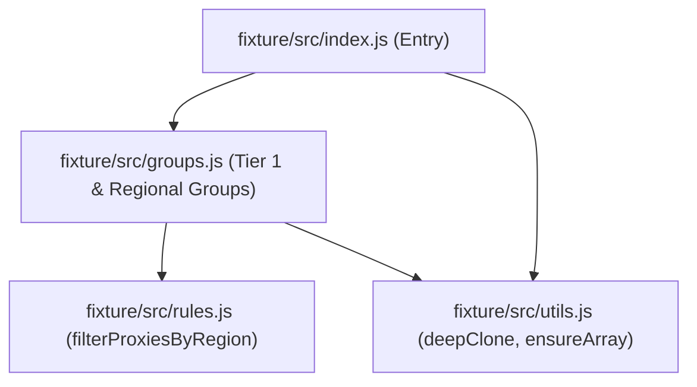

# Clash Fleet — Gate A 构建门禁调研与实验验证报告 (Gate A Build Findings - Revised)

- **调研角色**: Browser Lead & Agentic Team
- **文档状态**: Gate A 原型实验结果持久化沉淀 (Gate A Verified Findings — Revised Post-Review)
- **基准提交**: `main @ 77672466e01b01ac96650b88c71032440f0bf184`
- **原型分支**: `prototype/build-gate`
- **日期**: 2026-09-30

---

## 1. 核心问题与实验目标

在 Clash Fleet 架构流水线中，JavaScript 分流与编排逻辑需解耦为模块化源码仓库进行敏捷维护，但最终交付至客户端时，必须受限于 Clash Verge Rev (CVR) 的执行机制：

> **核心问题**: 多个模块化 JavaScript 源文件，怎样最简单可靠地生成一个 Clash Verge Rev 可以实际执行的单一 `Script.js`？

本实验在 `prototype/gate-a/` 建立了最小、隔离、完全可重复的自动化原型环境，针对真实的 `boa_engine = 0.22.0` 执行产物，取得可被完全验证的一手运行数据。

---

## 2. Clash Verge Rev 运行时一手事实与合约边界

经核实 CVR 主线一手源码，确认以下三项运行时硬边界：

### 2.1 脚本静态校验合约 (`validate.rs`)
CVR 在导入或保存脚本时，由 `src-tauri/src/core/validate.rs` 执行预检：
1. **CVR 源码静态 Marker 检查**:
   ```rust
   let has_main = content.contains("function main") ||
                  content.contains("const main") ||
                  content.contains("let main");
   ```
   **若源码未字面量包含上述三种声明之一，直接拦截并报错**: `"Script must contain a main function"`。
2. **Boa 0.22.0 语法解析**:
   在独立的 Boa Context 中通过 `eval` 进行语法树解析，任何未捕获的语法错误（如非模块模式下的顶层 `export`/`import`）均会导致校验失败。

### 2.2 脚本运行时调用合约 (`script.rs`)
CVR 在配置组装流水线 `src-tauri/src/enhance/script.rs` 中执行脚本：
```rust
let code = format!(
    r"try{{
    {script};
    JSON.stringify(main(JSON.parse(globalThis.__verge_config__),'{safe_name}')||'')
  }} catch(err) {{
    `__error_flag__ ${{err.toString()}}`
  }}"
);
```
- **Callable Global Main**: 执行时直接在全局作用域调用 `main(config, profileName)`；若被闭包隔离在 IIFE 内部未暴露，即便满足上述静态 Marker 检查，运行时亦会抛出 `TypeError: Callable global 'main' is not defined`。
- **无内置模块加载器**: 运行时仅接受单一 script 文本，沙箱中未提供 `require()`、`module.exports` 或 ES 模块异步解析器。

### 2.3 Boa 0.22.0 实际语法能力实测
与早期 Boa 版本不同，实测确认 `boa_engine = 0.22.0` 已原生支持大部分现代 ES 特性：
- `const` / `let`（块级与顶层作用域支持完备）；
- 箭头函数 `() => {}`、模板字符串 `` `...` ``；
- 对象与数组展开运算符 `...`、解构赋值 `[a, ...rest] = arr`；
- 数组高阶方法（`.map()`、`.filter()`、`.forEach()`）；
- 原生正则表达式 `/regex/i` 与 `JSON.parse` / `JSON.stringify`。
- **限制**: 普通脚本模式（Script Mode）下不支持顶层 `import` 与 `export` 关键字（抛出 `SyntaxError: unexpected token 'export'`）。

---

## 3. Harness 定位、架构与 Fail-Closed 机制

### 3.1 Harness 定位 (Bounded CVR Compatibility Harness)
> **明确约束边界**：
> 本测试 Harness 是一套 **Bounded CVR Compatibility Harness**，仅模拟 Gate A 所需的 observable contract：
> - Boa 0.22.0 沙箱下的单脚本 parse / eval；
> - CVR static main marker 检查；
> - 全局作用域下 callable global `main(config, profileName)` 调用；
> - 无 CommonJS loader / require 等宿主泄漏；
> - fixture 输入输出行为匹配 (Deep Equal)。
> 
> **它不是 CVR runtime 的完整 emulator**。CVR 生产运行时的其余控制面行为（如 execution timeout、loop iteration limit、log/output limits、config lowercasing、error fallback 及 result mapping 等）不属于 Gate A 构建门禁范围，留待后续阶段验证。

### 3.2 模块化 Fixture 依赖拓扑
Fixture 包含 3 个独立业务模块与 1 个主入口，展示真实的模块组合与分层依赖：

- **输入**: `fixture/data/input.json`（真实包含多区域节点与现有配置）；
- **输出**: `fixture/data/expected.json`（经规则匹配、分类组装后的策略组与元数据）。

### 3.3 Fail-Closed Gate 断言体系
测试套件（`harness/run-suite.js`）内置了严格的预期矩阵（`EXPECTED_MATRIX`）：
- 对所有候选方案（包含正向适配方案与负向对照组）的每一项指标进行硬编码断言；
- 任何与预期矩阵不一致的结果（包括适配方案意外失败、或负向对照组意外通过），**测试脚本必须输出详细的诊断信息并以非零状态码 (`process.exit(1)`) 退出**，杜绝“仅打印警告但测试静默通过”的假阳性风险。

---

## 4. 候选方案（Candidate Build Shapes）及实测对比

我们对 3 大类（细分为 7 种形态，包含 3 组负向对照组）进行了完全同等的自动化构建与运行验证：

| 方案 / 形态 | 单一文件 | CVR 静态 Marker | Boa 0.22.0 语法解析 | Callable 全局 Main | 输出 Deep Equal | 零 Node 宿主泄漏 | 重复构建确定性 | 产物大小 (Bytes) | 判定结果 (Verdict) |
|---|:---:|:---:|:---:|:---:|:---:|:---:|:---:|:---:|:---:|
| **Candidate 1: Minimal Concat (Stripping Adapter)** | PASS | PASS | PASS | PASS | PASS | PASS | PASS | 3593 | **SUPPORTED WITH SMALL ADAPTER** |
| *Candidate 1 (Naive Negative Control): Raw Concat* | PASS | PASS | FAIL | FAIL | FAIL | PASS | PASS | 3641 | **NOT VIABLE** |
| **Candidate 2: esbuild (IIFE + Footer Adapter)** | PASS | PASS | PASS | PASS | PASS | PASS | PASS | 3982 | **SUPPORTED WITH SMALL ADAPTER** |
| *Candidate 2 (Naive Negative Control): esbuild Default* | PASS | PASS | PASS | FAIL | FAIL | PASS | PASS | 2815 | **NOT VIABLE** |
| **Candidate 3A: Rollup Flat (Scope Hoisting + Strip)** | PASS | PASS | PASS | PASS | PASS | PASS | PASS | 3482 | **SUPPORTED WITH SMALL ADAPTER** |
| **Candidate 3B: Rollup IIFE (IIFE + Footer Adapter)** | PASS | PASS | PASS | PASS | PASS | PASS | PASS | 3931 | **SUPPORTED WITH SMALL ADAPTER** |
| *Candidate 3 (Naive Negative Control): Rollup Default* | PASS | PASS | PASS | FAIL | FAIL | PASS | PASS | 3736 | **NOT VIABLE** |

*注：产物大小数据严格取自修正后最终一次 `npm test` 实际运行输出。*

---

## 5. 关键实测现象与根因深度剖析

### 5.1 Static Marker 与 Callable Global Main 的解耦证明
测试明确证明了静态文本检查与运行时全局可调用是两个完全不同的合约维度：
- 在 **Candidate 2 (Naive esbuild)** 与 **Candidate 3 (Naive Rollup)** 中，源码内部均含有 `function main(...)`，因而完全能通过 CVR `validate.rs` 的字符串静态包含检查（`staticMainMarker: PASS`）；
- 但在实际 Boa 0.22.0 执行时，由于函数被封装在 IIFE 闭包私有作用域中，CVR 在全局执行 `main(...)` 时必然触发 `TypeError: Callable global 'main' is not defined`（`globalCallableMain: FAIL`）。
- 因此，任何 bundler 的默认 IIFE 模式都必须借助适配器（如 Footer Bridge）才能使入口函数真正可调用。

### 5.2 适配器（Adapters）形态与复杂度对比
所有能够满足 CVR 合约的方案，在构建流水线中均包含各自的适配器逻辑：
1. **Candidate 1 (Minimal Concat)**:
   - **适配器形态**: 纯 Node.js 拓扑排序读取 + 正则剥离 `import` 和 `export` 关键字。
   - **局限**: 缺乏真正的 AST 符号作用域分析，若不同模块内部存在同名私有顶层常量（如均定义了 `const TIMEOUT = 300`），将产生语法重定义冲突。
2. **Candidate 2 (esbuild IIFE)**:
   - **适配器形态**: 打包为 IIFE 并挂载 `fleetBundle` 全局对象，通过 `footer` 注入桥接函数：
     `function main(config, profileName) { return fleetBundle.main(config, profileName); }`
   - **开销**: 生成了较多 CommonJS 运行时兼容辅助函数（`__defProp`, `__copyProps`, `__toCommonJS` 等），产物达 3982 字节。
3. **Candidate 3A (Rollup Flat / Scope Hoisted)**:
   - **适配器形态**: Rollup 以 `format: 'es'` 输出单文件，配合微小的确定性 post-process 适配器剥离末尾的 `export { main };` 语句。
   - **特性**: 依靠 Rollup 原生的 AST 分析和 Scope Hoisting，直接将多模块合并展开在同一个扁平作用域中，模块内部同名变量被 AST 自动重命名，末尾剥离 export 后直接原生暴露 `function main(...)`。
4. **Candidate 3B (Rollup IIFE)**:
   - **适配器形态**: 标准 IIFE 挂载 + footer bridge，产物 3931 字节。比 esbuild 干净（无 CommonJS helper），但仍有一层闭包封装。

---

## 6. 决策评估与推荐候选

### 6.1 决策分类判定
- **SUPPORTED WITH SMALL ADAPTER**:
  - `Candidate 3A (Rollup Flat + Export Stripping Adapter)`
  - `Candidate 1 (Minimal Concat Generator + Stripping Adapter)`
  - `Candidate 2 (esbuild IIFE + Footer Adapter)`
  - `Candidate 3B (Rollup IIFE + Footer Adapter)`
- **NOT VIABLE**:
  - `Candidate 1 (Naive Raw Concat)`: Boa 报 `SyntaxError: unexpected token 'export'`。
  - `Candidate 2 (Naive esbuild)`: 闭包隔离导致全局 `main` 未定义。
  - `Candidate 3 (Naive Rollup)`: 闭包隔离导致全局 `main` 未定义。

### 6.2 推荐候选 (Recommended Candidate)
**本阶段基于严谨实验事实推荐：Candidate 3A (Rollup Flat / Scope-Hoisted Mode)**。

**推荐理由（严格基于实测证据）**：
1. **语义最自然的原生顶层入口**:
   Rollup 借助 AST 级的作用域提升（Scope Hoisting），将所有模块展开在单一顶级上下文，经确定性的末尾 export 剥离后，直接呈现为原生顶层声明 `function main(...)`。既满足 CVR `validate.rs` 静态字符串规则，又在执行阶段直接处于全局顶层，无需通过二级对象间接转发调用。
2. **零运行时辅助代码 (Zero Runtime Helper Overhead)**:
   相比 esbuild 注入的 `__toCommonJS`、`__copyProps` 等对象反射垫片，Rollup Flat 生成的代码极度纯净，无任何 loader 或 polyfill，对 Boa 0.22.0 沙箱的执行语义摩擦最小。
3. **工业级符号隔离与依赖分析 (Superior to Concat)**:
   具备完整的 JS AST 分析、树摇优化（Tree-shaking）和符号自动重命名能力。即使多个模块内部包含相同命名的局部私有标识符，Rollup 也能在编译期安全重命名，彻底规避了简易 Concat 正则拼装必然面临的命名冲突风险。
4. **产物体积最优**:
   在测试 fixture 中产物仅 3482 字节，为全部可用候选方案中体积最小（相比 esbuild 3982 字节减小约 12.6%）。
