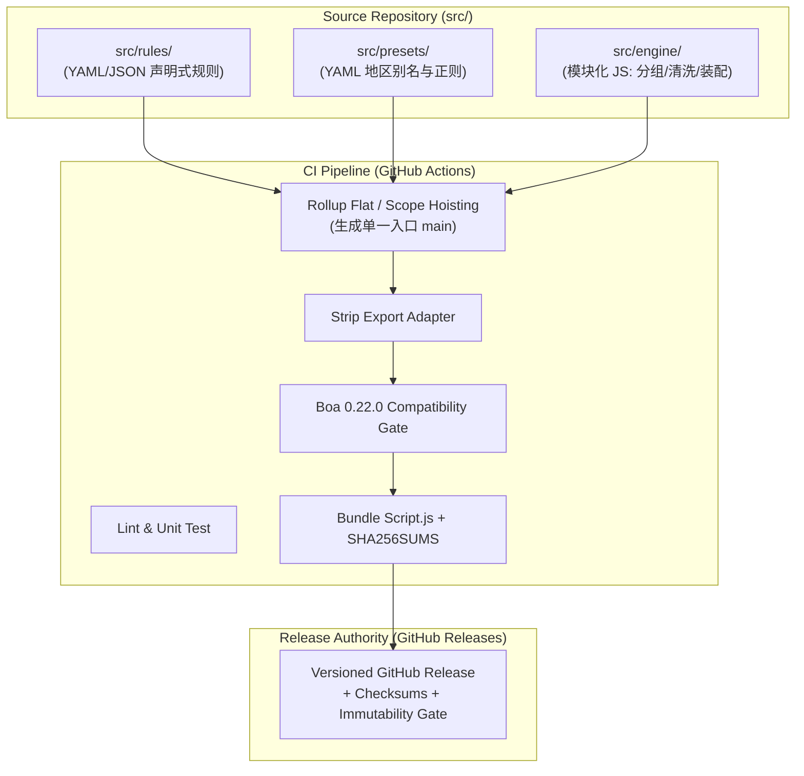
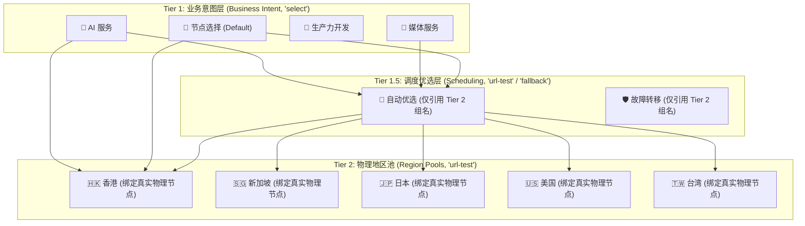

# Clash Fleet 架构规格说明书 (Architecture Spec Candidate)

- **文档状态**: 生产架构规格说明书 (Canonical Architecture Spec — Browser Review PASS)
- **基准提交**: `main @ d90a85ade11e6a17c70386dae8190a8803a2b83f`
- **日期**: 2026-10-01
- **适用版本**: V1 Toolchain

---

## 1. 概述与核心愿景 (Overview & Vision)

Clash Fleet 是专为基于 Clash Verge Rev (CVR) 与 Mihomo (原 Clash.Meta) 内核环境打造的多设备配置分发、部署与诊断工具链。

### 1.1 设计目标
1. **可靠性优先**: 杜绝因手动编辑单体脚本导致的语法崩溃与分流静默降级；
2. **数据与逻辑解耦**: 将海量规则与日常业务声明化，核心算法模块化，运行时交付确定性构建产物；
3. **闭环可自愈部署**: 建立具备写前静态校验、原子覆盖、生命周期触发、多维运行态验证与失败自动回滚的稳健发布链路；
4. **敏感凭据物理隔离**: 公共仓库绝不包含用户订阅凭据（public repository contains zero user credentials），最小化凭据暴露与密钥处理面，Fleet V1 绝不向任何 Fleet 托管服务传输订阅凭证。

---

## 2. 源码架构与构建管道 (Source Architecture & Build Pipeline)



### 2.1 混合源码模型 (Hybrid Source Model) `[Architecture Decision]`
为解决单体 500+ 行 `clash-verge-script.js` 维护脆弱的问题，采用数据与行为分离的混合源码模型：
- **声明式数据层 (`src/rules/`, `src/presets/`)**:
  - 用户日常维护的直连/拒绝列表、AI 与媒体服务路由、地区匹配别名正则字典等采用纯结构化 YAML/JSON 数据定义，严禁包含复杂控制逻辑；
- **配置装配引擎层 (`src/engine/`)**:
  - 采用模块化 ES 语法编写节点规范化、正则归类、策略拓扑组装、Sniffer 注入等纯算法逻辑；
- **只读构建产物 (`dist/Script.js`)**:
  - 最终交付给 CVR 执行的 `profiles/Script.js` 被严格定义为**确定性编译生成的只读构件 (Build Artifact)**，严禁人工直接编辑修改。

### 2.2 生产构建方案：Rollup Flat / Scope Hoisting `[Architecture Decision]`
基于 Gate A 构建门禁实测验证结论 `[Verified]`：
- 采用 **Rollup Flat (Scope Hoisting)** 模式将模块化源码扁平化展开至单一作用域；
- 配合末端确定性适配器剥离 `export { main };`，生成纯净的原生顶层 `function main(config, profileName)` 声明；
- **零运行时宿主垫片**: 杜绝 esbuild 等打包器引入的 `__toCommonJS` / `__copyProps` 反射开销，生成体积最小（在 Gate A fixture 中约 3.4KB）、对 Boa 沙箱语义摩擦最小的代码；
- **编译期符号隔离**: 由 Rollup AST 级静态分析自动重命名模块私有局部变量，规避简易拼接（Concat）存在的符号冲突风险。

### 2.3 CI 质量门禁与 Boa 0.22 兼容性验证 `[Architecture Decision]`
- CVR 主线明确锁定运行引擎为 `boa_engine = "0.22.0"` `[Verified]`；
- CI 持续集成流水线必须内置 **Boa 0.22.0 Compatibility Harness**：
  要求基于精确锁定的 `boa_engine = "0.22.0"` 运行环境执行验证：
  1. 静态字符串 Marker 检查（确保包含 `function main` 等合法声明）；
  2. 产物的真实 Boa AST 语法解析与 `eval`；
  3. 全局作用域下调用 callable global `main(config, profileName)` 并验证关键策略组语义结构与 Deep Equal 输出。
- **实现封装解耦**: 该门禁可采用 embedded `boa_engine` 测试套件或经实测等价的 CLI 工具封装实现，不在架构规格中提前机械锁定外部 CLI 打包方式。
- 任何无法在该环境中通过验证的代码一律禁止进入 Release 打包。

---

## 3. 配置归属与控制面边界 (Configuration Ownership & Boundaries)

| 配置维度 | 归属实体 | 运行时机制与边界定义 | 证据级别 |
|---|---|---|:---:|
| **策略组拓扑与分流规则** | **Fleet Script.js** | 动态构建业务组、调度组与地区池，挂载 Rule Providers | `[Architecture Decision]` |
| **Sniffer 域名嗅探** | **Fleet Script.js** | 注入 `sniffer` 并在 `tls`/`http` 开启 `parse-pure-ip: true` 作为共享配置行为 | `[Architecture Decision]` |
| **大型静态规则数据集** | **Rule Providers** | 外部托管标准规则（Loyalsoldier / MetaCubeX），内核异步加载 | `[Architecture Decision]` |
| **节点规范化与分类** | **Fleet Script.js** | 运行期在内存中对 `config.proxies` 进行清洗、衍生分类与国家正则归类 | `[Architecture Decision]` |
| **TUN / DNS 权威字段** | **CVR App State** | CVR GUI 接管的权威控制面字段，流水线末端强制覆盖，Fleet 避免越权 | `[Verified]` |
| **系统代理开关 (System Proxy)** | **OS / CVR Client** | 操作系统级系统网络配置，脱离配置脚本管辖 | `[Verified]` |

### 3.1 CVR 权威控制面规避原则 `[Verified]`
CVR 源码在 `src-tauri/src/enhance/mod.rs` 中明确定义了权威控制面（Authoritative Control Plane）覆盖逻辑：
- GUI 管理的 `tun` 配置、接管的 `dns` 字段以及 `CONTROL_PLANE_KEYS` 会在配置流水线最末端无条件覆盖 Script/Merge 的输出；
- **Fleet 设计边界**: Fleet 共享配置核心专注分流逻辑编排与规则集注入，**绝不强行持有设备专有的网卡接管与监听端口配置**，杜绝与宿主 CVR 的配置冲突。

---

## 4. 重度用户自定义模型 (Heavy-User Customization Model)

用户日常运维完全实现“数据驱动”，通过小粒度声明式文件进行维护，杜绝触碰核心执行代码。

```text
src/
├── rules/
│   ├── direct.yaml           # 自定义直连域名/IP 清单
│   ├── reject.yaml           # 自定义广告与风控拦截名单
│   ├── ai-services.yaml      # AI/LLM 域名、OAuth 依赖与区域约束声明
│   └── platforms/
│       ├── darwin.yaml       # macOS 专有 PROCESS-NAME / PROCESS-PATH 规则声明
│       └── win32.yaml        # Windows 专有 PROCESS-NAME 规则声明
├── presets/
│   ├── regions.yaml          # 物理地区正则匹配字典与权重别名
│   └── policy-topology.yaml  # 策略组优先级与意图层级声明
└── engine/                   # 模块化纯函数算法代码
```

### 4.1 高频操作规范示例
1. **新增直连域名**:
   - 在 `src/rules/direct.yaml` 中追加域名条目（如 `+example.internal`），无需修改任何 JS 代码；
2. **新增 AI 服务路由**:
   - 在 `src/rules/ai-services.yaml` 声明服务域名与目标策略（如 `🤖 AI 服务`），由引擎在构建期展开为 SukkaW 执行序保护规则；
3. **调整地区识别正则**:
   - 在 `src/presets/regions.yaml` 调整匹配 pattern（如新增小众节点前缀），不破坏核心分组逻辑；
4. **跨平台进程分流声明**:
   - macOS 专有进程写入 `darwin.yaml`，Windows 专有进程写入 `win32.yaml`；
   - 构建期按声明式数据合并至 Universal 规则链。

---

## 5. 策略组分层拓扑架构 (Policy Topology Architecture)

正式采纳并冻结**三级分层拓扑架构 (Three-Tier Policy Topology)** `[Architecture Decision]`，同时坚持按需裁剪原则：



### 5.1 各层职责与生命周期
- **Tier 1 (业务意图层，`select`)**:
  - 用户交互与规则分流的直接承载点；
  - 默认首选指向 Tier 1.5 优选组，同时允许用户手动指定直接选择 Tier 2 地区池或特定物理节点；
- **Tier 1.5 (调度优选层，按需创建)**:
  - **核心约束**: **只引用 Tier 2 地区组名，严禁直接挂载物理节点**；
  - 架构意图在于避免直接重复挂载物理节点，将健康探测所有权尽量收敛集中在 Tier 2 地区池，避免明显的重复探测开销，仅在地区池粒度进行优选调度；非必要业务组不强行制造空转的 Tier 1.5；
- **Tier 2 (物理地区池，`url-test`)**:
  - 依据规范化正则表达式绑定具体的物理代理节点并执行单点健康探测；
  - **动态裁剪**: 若订阅中某个地区池节点数为 0，引擎自动裁剪该地区组，并从上层 Tier 1 / Tier 1.5 的引用列表中剔除，杜绝无效路由。

---

## 6. 多订阅聚合与机密安全边界 (Multi-Subscription & Secrets Boundary)

### 6.1 凭据物理隔离与所有权边界 `[Architecture Decision]`
- **公共仓库零机密**: Git 仓库绝对不持久化保存任何个人订阅 URL、Token、API Key、Cookie 或私有凭证；
- **CVR 本地拥有订阅凭据与拉取**: 订阅 URL 及定时拉取完全由本地各设备客户端的 CVR GUI 本地配置管理；
- **不跨 Profile 自动聚合**: Fleet V1 不负责把多个独立 CVR Profiles 自动聚合，亦不暗示多个独立 Profile 会自动合并出现在 `config.proxies` 中。如果用户需要同时使用多个订阅的物理节点，必须先在本地 CVR 中通过其内置的 Profile 合并、Proxy Provider 或本地配置机制组合成当前生效配置；
- **纯函数内存处理**: Fleet 扩展脚本仅处理 CVR 实际传入的当次生效配置 (`config.proxies`)，Fleet 自身不抓取、不合并亦不持有任何订阅 Secrets。

### 6.2 内存级节点规范化、去重与引用完整性守卫 `[Architecture Decision]`
当 CVR 刷新订阅并执行扩展脚本时，Fleet `Script.js` 在纯内存环境中对传入的 `config.proxies` 执行标准化清洗：
1. **垃圾过滤**: 剔除流量剩余提示、通知信息等无效节点；
2. **名称衍生与引用完整性守卫 (Normalized Label vs Referential Integrity)**:
   - 地区分类与策略匹配优先使用**派生的规范化标签 (derived normalized label)** 进行正则匹配，默认不破坏性修改原始 `proxy.name`；
   - 默认坚持“normalize for matching/classification”原则；
   - 若未来实现确需修改物理节点的 `proxy.name`，必须同时原子扫描并更新配置中所有相关 `proxy-groups` 的节点引用列表，严格保证引用完整性（Referential Integrity）；
   - 无法严格证明全配置引用一致性时，坚决禁止执行破坏性 rename；
3. **安全语义等价去重 (Equivalence Dedup)**: 
   - 严禁仅依赖 `server` + `port` 去重（因不同协议、认证凭据、TLS/SNI 设置可共享端口）；
   - 只有当完整的规范化节点身份（Normalized Proxy Identity，涵盖 server, port, type, cipher, uuid/password, transport, tls/sni 等关键配置）被证明语义完全等价时才允许去重；
   - 无法确证等价时必须安全保留节点，杜绝任何无可靠排序语义的“保留最新”逻辑；
4. **正则归类**: 依据预置字典快速分派至对应 Tier 2 物理地区池。

---

## 7. 跨平台架构与交付形态 (Cross-Platform Architecture)

### 7.1 单一 Universal 构件交付与进程规则共存 `[Architecture Decision]`
- 发布构件保持为唯一的 `Script.js`，跨平台共享 100% 相同的分流逻辑核心；
- 平台专属进程差异通过声明式数据（`darwin.yaml` / `win32.yaml`）合入同一构件；
- **跨平台进程规则共存验收要求 (Implementation Acceptance Requirement)**:
  - 生成的 universal script 必须在 macOS 与 Windows 双平台均通过语法解析与执行调用；
  - 平台专有的 PROCESS 规则不得破坏另一平台的配置校验与加载；
  - 若未来现场验证证明特定进程规则引发跨平台严重冲突，必须作为 `ARCHITECTURE_CONFLICT` 显式上报，严禁未经实证静默分裂为两套路由核心。

### 7.2 平台适配器矩阵与动态拓扑/特权探测 (Platform Adapter Matrix)

平台差异严禁硬编码为系统固有属性，生产部署适配器必须动态探测宿主环境 `[Architecture Decision]`：

| 适配器维度 | macOS Adapter | Windows Adapter |
|---|---|---|
| **默认 CVR 配置目录** | `~/Library/Application Support/io.github.clash-verge-rev.clash-verge-rev` | `%APPDATA%\io.github.clash-verge-rev.clash-verge-rev` |
| **运行时文件替换** | 直接写入 / `os.replace` 原子替换 `[Verified]` | 直接写入 / Win32 `MoveFileExW` 原子替换 `[Verified]` |
| **实测现场拓扑 (Observed Test Host)** | **Service 模式** (`clash-verge-service` 托管) `[Host-observed]` | **Sidecar 模式** (`verge-mihomo.exe` 直接子进程) `[Host-observed]` |
| **实测现场权限 (Observed Test Host)** | 标准普通用户 (Non-root, uid 501) `[Host-observed]` | 高完整性/管理员权限 (`~ RUNASADMIN` 兼容项) `[Host-observed]` |
| **生产适配器动态探测要求** | 动态探测 Service vs Sidecar 托管状态；动态选择生命周期触发路径 | 动态探测 Service vs Sidecar；**动态探测特权级别 (Standard vs Elevated)**，严禁泛化“Windows 总是需要提权” |
| **无头生效触发路径** | 普通权限 `kill -15 <PID>` + `open -a "Clash Verge"` `[Host-observed / Verified]` | 依据动态探测特权选择 `Stop-Process` / `taskkill` + `Start-Process` `[Source-supported / Inferred]` |

*注：Windows 生产适配器将受控进程重启作为当前可行候选机制，但由于 Gate B 中完整 elevated restart 链条标定为 Reported / Not Directly Captured，具体触发链路需在实现阶段完成现场全链路闭环核准。*

---

## 8. 发布权威与构件不可变性 (Release Authority & Immutability)

- **唯一发布权威**: **GitHub Releases** `[Architecture Decision]`；
- **发布资产结构**:
  - `Script.js`: 生产唯一通用扩展脚本构件；
  - `SHA256SUMS.txt`: 包含 `Script.js` 的 SHA-256 强密码学校验和清单；
- **不可变发布策略**:
  - 采用语义化版本标签（SemVer Tag，如 `v1.0.0`）；
  - 结合校验和核验与不可变性门禁（Enforced/Verified Immutability Gate），不将 SemVer 标签本身等同于已生效的不可变保护；具体的 GitHub Release 资产防篡改策略作为 Release Implementation Gate 落地；
- **明确规避清单**:
  - 严禁使用 mutable raw git branch 作为生产部署源；
  - 严禁使用 GitHub Gist 作为生产分发凭据；
  - 严禁在客户端直接执行 `git pull` 源码作为生产更新机制。

### 8.1 规则资产可重现性与来源策略 (Rule Asset Reproducibility & Provenance Policy) `[Architecture Decision]`
为解决“相同 Script.js 搭配可变外部规则导致实际分流行为不一致”的问题，建立明确的规则资产溯源策略：
1. **优先固定上游不可变修订 (Pin Immutable Revision)**:
   - 对于外部引用的 Rule Providers（如 Loyalsoldier 等），优先绑定具体的不可变上游 Git Commit SHA 或固定版本的 Release 资产 URL；
2. **动态外部依赖显式标记 (Dynamic External Dependency)**:
   - 若某 Rule Provider 因业务必须指向动态更新（如 `HEAD` / `master`），必须在 Release Manifest 中显式标注为 `Dynamic External Dependency`，且该 Release 不得宣称对该外部规则具备 fully reproducible 保证；
3. **发布清单溯源记录 (Provenance Manifest)**:
   - 每个 Fleet Release 必须记录所引用的每个 Rule Provider 的唯一标识、来源策略与版本/URL 快照；
4. **回滚语义与规则资产状态 (Rollback Semantics)**:
   - **固定版本规则资产 (Pinned Rule Asset)**: 部署器执行 rollback 时，必须同步恢复与目标 Fleet Release Manifest 完全对应的固定版本规则引用/资产，以保证分流行为的可重现回滚 (reproducible behavioral rollback)；
   - **动态外部依赖 (Dynamic External Dependency)**: 对于指向动态可变上游最新更新的规则，由于外部内容已随时间演进，脚本回滚无法保证恢复历史规则内容，部署器必须显式报告为 `partial / non-fully-reproducible rollback`，绝对不得将当前机器偶然存在的本地缓存视为可靠的回滚权威；
   - 具体资产快照与缓存恢复机制作为后续 Release Implementation Gate 落实。

---

## 9. 部署事务与多维运行时验证 (Deployment Transaction & Verification)

### 9.1 完整事务时序 (Transaction Flow)

```text
[1. Discover]  --> 查询 GitHub Releases 获取目标版本与 SHA256SUMS
[2. Fetch]     --> 下载 Script.js 构件至本地临时沙箱缓存
[3. Checksum]  --> 计算本地 SHA-256 并与清单强比对；不匹配则立即中止
[4. Preflight] --> 本地 Boa 0.22 验证器执行语法解析与 callable main marker 校验
[5. Backup]    --> 将当前 profiles/Script.js 复制为 profiles/Script.js.bak
[6. Replace]   --> 执行原子替换写入 profiles/Script.js
[7. Trigger]   --> 平台适配器依据动态探测结果执行受控生命周期优雅重载
[8. Verify]    --> 多维运行时验证（强制路径：进程/时效/结构不变量/动态端口探测；可选路径：API增强）
       |
       +--> [Verify Success] --> 清理临时缓存，确认部署成功
       |
       +--> [Verify Failure] --> 触发 Auto-Rollback 还原 Script.js.bak 并重载恢复
```

### 9.2 多维运行时验证标准 (Runtime Verification Criteria) `[Architecture Decision]`
Gate B 已确证：单纯检查 `clash-verge.yaml` 的修改时间（mtime）不足以证明部署成功（脚本语法错误时 CVR 会静默降级为裸订阅配置，进程仍然存活但分流失效）`[Verified]`。

因此，部署器在触发重载后必须在有界超时窗口内完成以下验证：

#### A. 强制验证路径 (Mandatory Verification Path - 不依赖 External Controller)
1. **进程与核心恢复 (Process Recovery / Liveness)**:
   - 通过操作系统接口验证 CVR 主进程与 Mihomo 核心进程存活；
2. **配置文件更新时效 (Timestamp Refresh)**:
   - `clash-verge.yaml` 的修改时间 (mtime) 晚于部署事务发起时间戳；
3. **配置结构语义不变量验证 (Semantic Invariant Check)**:
   - 解析运行中生成的 `clash-verge.yaml`，断言核心语义结构存在：
     - `proxy-groups` 顶层必须包含当前 Release 定义的基线意图组（如 `🔰 节点选择`、`🤖 AI 服务`）；
     - `rules` 顶层包含 Fleet 声明的前置规则；
     - 若该 Release 启用了 Sniffer，断言 `sniffer` 与 `parse-pure-ip` 配置生效；
     - 若上述结构缺失，判定为 CVR 发生“静默降级”，触发回滚；
4. **动态发现本地代理端口并探测连通性 (Discovered Endpoint Connectivity Probe)**:
   - **禁止硬编码端口**: 部署器从生成的 `clash-verge.yaml` 或 CVR 生效配置中**动态解析发现**实际启用的本地监听端口（如 `mixed-port`、`port` 或 `socks-port`）；
   - 若发现可用本地代理端口，向受信任端点（如 `http://cp.cloudflare.com/generate_204`）发起 HTTP 代理连通性探测断言返回 204；
   - **端口不可用时的 Fallback**: 若配置未开启本地代理端口（如仅启用纯 TUN 模式），执行定义的网络连通性探测降级兜底。

#### B. 可选增强验证 (Enhanced Verification - Optional)
- **External Controller 绝非 V1 强制依赖**: 不得要求用户为了 Fleet 部署专门启用 External Controller；
- 若 External Controller 当前已显式开启且可安全连接（如本地端口或 Unix Socket / Named Pipe 可访问），可执行 `GET /version` 与运行时配置比对作为增强健康检查，但不作为硬性阻断条件。

**任一强制验证项超时或断言失败，部署器必须立即执行自愈回滚流水线。**

---

## 10. 连续性目标与恢复预期 (Platform Continuity Target)

- **架构指标定级**: **受控秒级重载（Controlled Bounded Restart/Recovery with Automatic Rollback）** `[Architecture Decision]`；
- **明确边界声明**:
  - **拒绝虚假承诺**: Clash Fleet **不承诺 100% 零闪断 (Non-Zero-Downtime)**；
  - **macOS 实测状态**: 测试机运行于 `clash-verge-service` 托管模式 `[Host-observed]`；但 GUI 重启期间内核 PID 连续性与零中断未直接测量建立 (`NOT ESTABLISHED`)；
  - **Windows 实测状态**: 测试机运行于 Sidecar 模式 `[Host-observed]`；重启引发的内核退出、TUN 重建与 ~1.5–2.0s 网络抖动归类为 `[Reported / Not Directly Captured]`，不升级为 Verified platform fact；
- **恢复策略**:
  - 采用有界可配置的超时与恢复策略 (Bounded Configurable Timeout/Recovery Policy)；
  - 具体的超时判定数值在后续实现阶段通过实测标定，不预设未经建立的硬性绝对 SLA。

---

## 11. 私有/本地自定义边界 (Private / Local Customization Boundary)

为解决私有定制与 Canonical 不可变发布构件之间的矛盾，冻结以下边界 `[Architecture Decision]`：

1. **Canonical GitHub Release 纯粹性**:
   - 官方/公共 GitHub Release **仅由受版本控制的公共源码构建**；
   - 官方交付的 `Script.js` 构件具有确定性的 SHA-256 Checksum (deterministic SHA-256 checksum)，绝对不打包亦不包含任何私有/本地覆盖数据；
2. **私有/本地规则停留在本地端 (Device-Local Boundary)**:
   - 用户的私有白名单（如内网域名、专用直连 IP 等）保持在设备本地；
   - 优先通过 CVR 本地规则集、本地 Profile/Merge、或作为客户端专有的本地扩展缝隙（Client-Owned Extension Seam）进行加载；
   - 绝不通过二次修改官方 `Script.js` 破坏其 Checksum 校验一致性；
3. **本地衍生构建定位**:
   - 本地私有源码衍生构建（Local Derivative Build）不进入 V1 核心工具链，作为未来可选扩展演进。

---

## 12. V1 产品边界 (Product Boundary)

Clash Fleet V1 严格限定工程范围：
- **DO**:
  - 最小但专业的 CLI 工具链（`fleet build`, `fleet deploy`, `fleet verify`）；
  - 确定性 Rollup Flat 构建器与 Boa 0.22 验证器；
  - GitHub Actions 自动化版本化构件发布，并通过 release immutability gate；
  - 具备动态特权与拓扑探测的跨平台受控部署器。
- **DO NOT**:
  - 坚决不开发 Electron / Tauri GUI 桌面；
  - 坚决不运行常驻系统守护进程（Daemon / Background Service）；
  - 坚决不搭建通用订阅转译/聚合服务器；
  - 坚决不抽象过度复杂的规则集通用格式转译平台。
