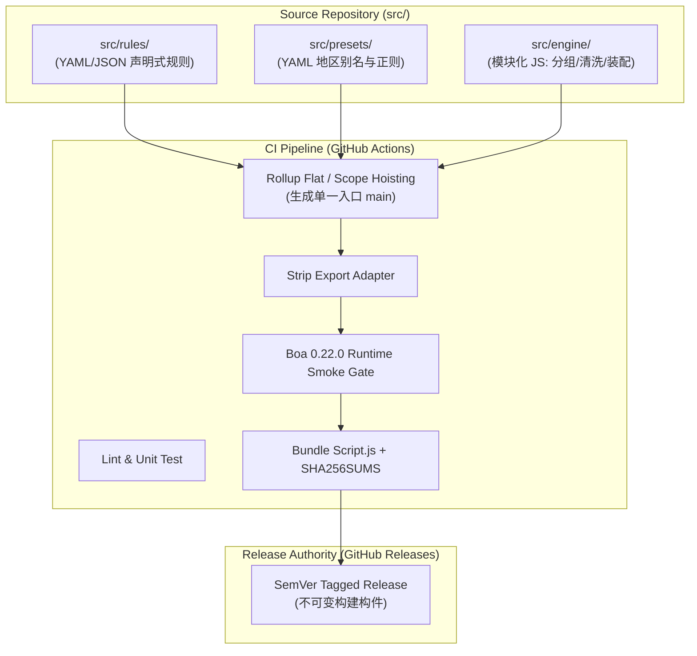
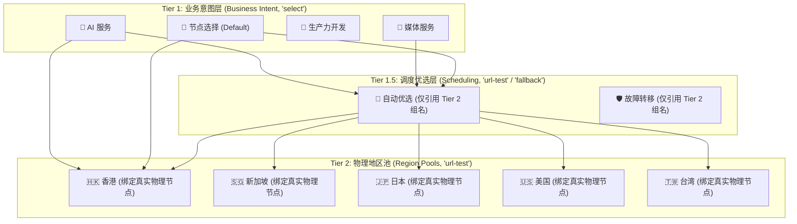

# Clash Fleet 架构规格说明书 (Architecture Spec SSOT)

- **文档状态**: 生产架构规格冻结文档 (Canonical Architecture / Spec SSOT)
- **基准提交**: `main @ d90a85ade11e6a17c70386dae8190a8803a2b83f`
- **日期**: 2026-10-01
- **适用版本**: V1 Toolchain

---

## 1. 概述与核心愿景 (Overview & Vision)

Clash Fleet 是专为基于 Clash Verge Rev (CVR) 与 Mihomo (原 Clash.Meta) 内核环境打造的多设备配置分发、部署与诊断工具链。

### 1.1 设计目标
1. **可靠性优先**: 杜绝因手动编辑单体脚本导致的语法崩溃与分流静默降级；
2. **数据与逻辑解耦**: 将海量规则与日常业务声明化，核心算法模块化，运行时交付确定性构建产物；
3. **闭环可自愈部署**: 建立具备写前静态校验、原子覆盖、生命周期触发、多维运行态验证与失败自动回滚的稳健发布链路；
4. **零安全攻击面**: 公共仓库物理隔离所有机场凭证与私有敏感数据。

---

## 2. 源码架构与构建管道 (Source Architecture & Build Pipeline)



### 2.1 混合源码模型 (Hybrid Source Model) `[Architecture Decision]`
为解决单体 500+ 行 `clash-verge-script.js` 维护脆弱的问题，采用数据与行为分离的混合源码模型：
- **声明式数据层 (`src/rules/`, `src/presets/`)**:
  - 用户日常维护的直连/拒绝列表、AI 与媒体服务路由、地区匹配别名正则字典等采用纯结构化 YAML/JSON 数据定义，严禁包含复杂控制逻辑；
- **配置装配引擎层 (`src/engine/`)**:
  - 采用模块化 ES 语法编写节点规范化、正则归类、策略拓扑组装、Sniffer 注入等纯算法逻辑；
- **只读构建产物 (`dist/Script.js`)**:
  - 最终交付给 CVR 执行的 `profiles/Script.js` 被严格定义为**确定性编译生成的只读构件 (Build Artifact)**，严禁人工直接编辑修改。

### 2.2 生产构建方案：Rollup Flat / Scope Hoisting `[Architecture Decision]`
基于 Gate A 构建门禁实测验证结论 `[Verified]`：
- 采用 **Rollup Flat (Scope Hoisting)** 模式将模块化源码扁平化展开至单一作用域；
- 配合末端确定性适配器剥离 `export { main };`，生成纯净的原生顶层 `function main(config, profileName)` 声明；
- **零运行时宿主垫片**: 杜绝 esbuild 等打包器引入的 `__toCommonJS` / `__copyProps` 反射开销，生成体积最小（约 3.4KB）、对 Boa 沙箱语义摩擦最小的代码；
- **编译期符号隔离**: 由 Rollup AST 级静态分析自动重命名模块私有局部变量，杜绝简易拼接（Concat）必然遭遇的符号命名冲突。

### 2.3 CI 质量门禁与 Boa 0.22 兼容性验证 `[Architecture Decision]`
- CVR 主线明确锁定运行引擎为 `boa_engine = "0.22.0"` `[Verified]`；
- CI 持续集成流水线必须内置 **Boa 0.22.0 Smoke Test Gate**：
  1. 静态字符串 Marker 检查（确保包含 `function main` 等合法声明）；
  2. 使用官方 `boa-cli 0.22.0` 执行生成产物的真实 AST 语法解析；
  3. 执行合成 fixture 输入调用 `main(config, profileName)` 并验证关键策略组结构与 Deep Equal 输出。
- 任何无法在 Boa 0.22 环境通过验证的代码一律禁止进入 Release 打包。

---

## 3. 配置归属与控制面边界 (Configuration Ownership & Boundaries)

| 配置维度 | 归属实体 | 运行时机制与边界定义 | 证据级别 |
|---|---|---|:---:|
| **策略组拓扑与分流规则** | **Fleet Script.js** | 动态构建业务组、调度组与地区池，挂载 Rule Providers | `[Architecture Decision]` |
| **Sniffer 域名嗅探** | **Fleet Script.js** | 注入 `sniffer` 并在 `tls`/`http` 开启 `parse-pure-ip: true`，抹平 DoH 纯 IP 绕过 | `[Verified]` |
| **大型静态规则数据集** | **Rule Providers** | 外部托管标准规则（Loyalsoldier / MetaCubeX），内核异步加载 | `[Architecture Decision]` |
| **节点规范化与分类** | **Fleet Script.js** | 运行期在内存中对 `config.proxies` 进行清洗、重命名与国家正则归类 | `[Architecture Decision]` |
| **TUN / DNS 权威字段** | **CVR App State** | CVR GUI 接管的权威控制面字段，流水线末端强制覆盖，Fleet 避免越权 | `[Verified]` |
| **系统代理开关 (System Proxy)** | **OS / CVR Client** | 操作系统级系统网络配置，脱离配置脚本管辖 | `[Verified]` |

### 3.1 CVR 权威控制面规避原则 `[Verified]`
CVR 源码在 `src-tauri/src/enhance/mod.rs` 中明确定义了权威控制面（Authoritative Control Plane）覆盖逻辑：
- GUI 管理的 `tun` 配置、接管的 `dns` 字段以及 `CONTROL_PLANE_KEYS` 会在配置流水线最末端无条件覆盖 Script/Merge 的输出；
- **Fleet 设计边界**: Fleet 共享配置核心专注分流逻辑编排与规则集注入，**绝不强行持有设备专有的网卡接管与监听端口配置**，杜绝与宿主 CVR 的配置冲突。

---

## 4. 重度用户自定义模型 (Heavy-User Customization Model)

用户日常运维完全实现“数据驱动”，通过小粒度声明式文件进行维护，杜绝触碰核心执行代码。

```text
src/
├── rules/
│   ├── direct.yaml           # 自定义直连域名/IP 清单
│   ├── reject.yaml           # 自定义广告与风控拦截名单
│   ├── ai-services.yaml      # AI/LLM 域名、OAuth 依赖与区域约束声明
│   └── platforms/
│       ├── darwin.yaml       # macOS 专有 PROCESS-NAME / PROCESS-PATH 规则
│       └── win32.yaml        # Windows 专有 PROCESS-NAME 规则
├── presets/
│   ├── regions.yaml          # 物理地区正则匹配字典与权重别名
│   └── policy-topology.yaml  # 策略组优先级与意图层级声明
└── engine/                   # 模块化纯函数算法代码
```

### 4.1 高频操作规范示例
1. **新增直连域名**:
   - 在 `src/rules/direct.yaml` 中追加域名条目（如 `+example.internal`），无需修改任何 JS 代码；
2. **新增 AI 服务路由**:
   - 在 `src/rules/ai-services.yaml` 声明服务域名与目标策略（如 `🤖 AI 服务`），由引擎在构建期展开为 SukkaW 执行序保护规则；
3. **调整地区识别正则**:
   - 在 `src/presets/regions.yaml` 调整匹配 pattern（如新增小众节点前缀），不破坏核心分组逻辑；
4. **跨平台进程分流隔离**:
   - macOS 专有进程（如 `.app/Contents/MacOS/git-credential-manager`）写入 `darwin.yaml`；
   - Windows 专有进程（如 `git-credential-manager.exe`）写入 `win32.yaml`；
   - 构建期按数据合并至 Universal 规则链，Mihomo 内核在非目标平台上天然静默穿透。

---

## 5. 策略组分层拓扑架构 (Policy Topology Architecture)

正式采纳并冻结**三级分层拓扑架构 (Three-Tier Policy Topology)** `[Architecture Decision]`，同时坚持按需裁剪原则：



### 5.1 各层职责与生命周期
- **Tier 1 (业务意图层，`select`)**:
  - 用户交互与规则分流的直接承载点；
  - 默认首选指向 Tier 1.5 优选组，同时允许用户手动指定直接选择 Tier 2 地区池或特定物理节点；
- **Tier 1.5 (调度优选层，按需创建)**:
  - **核心约束**: **只引用 Tier 2 地区组名，严禁直接挂载物理节点**；
  - 实现零冗余测速健康检查开销，仅在地区池粒度进行调度；非必要业务组不强行制造空转的 Tier 1.5；
- **Tier 2 (物理地区池，`url-test`)**:
  - 依据规范化正则表达式绑定具体的物理代理节点并执行单点健康探测；
  - **动态裁剪**: 若订阅中某个地区池节点数为 0，引擎自动裁剪该地区组，并从上层 Tier 1 / Tier 1.5 的引用列表中剔除，杜绝无效路由。

---

## 6. 多订阅聚合与机密安全边界 (Multi-Subscription & Secrets Boundary)

### 6.1 凭据物理隔离 `[Architecture Decision]`
- **公共仓库零机密**: Git 仓库绝对不持久化保存任何个人订阅 URL、Token、API Key、Cookie 或私有凭证；
- **本地 CVR 拥有凭据**: 用户的 3 个不同机场订阅（CreamData, HutaoCloud, 猫猫云1）由各设备客户端的 CVR GUI 本地 Profiles 独立管理拉取与定时刷新；
- **Fleet 无服务器化**: V1 阶段不自建远端订阅聚合转换服务，亦不强依赖常驻 Sub-Store 容器。

### 6.2 内存级节点规范化流水线 `[Architecture Decision]`
当 CVR 刷新任一订阅并执行扩展脚本时，Fleet `Script.js` 在纯内存环境中对传入的 `config.proxies` 执行标准化清洗：
1. **垃圾过滤**: 剔除流量剩余提示、通知信息等无效节点；
2. **名称标准化**: 统一清洗协议前缀，规范化国旗与地区标识（如 `🇭🇰 HK | 香港 01`）；
3. **安全去重 (Safe Dedup)**: 基于 `server` + `port` 确定性指纹去重，保留最新节点；
4. **正则归类**: 依据预置字典快速分派至对应 Tier 2 物理地区池。

---

## 7. 跨平台架构与交付形态 (Cross-Platform Architecture)

### 7.1 单一 Universal 构件交付 `[Architecture Decision]`
- 发布构件保持为唯一的 `Script.js`，跨平台共享 100% 相同的分流逻辑核心；
- 平台专属差异通过声明式数据（`darwin.yaml` / `win32.yaml`）合入同一构件；
- Mihomo 内核在非宿主平台对不匹配的 `PROCESS-NAME` 规则天然静默忽略，无运行开销。

### 7.2 平台适配器矩阵 (Platform Adapter Matrix)

| 适配器维度 | macOS Adapter | Windows Adapter |
|---|---|---|
| **CVR 配置目录** | `~/Library/Application Support/io.github.clash-verge-rev.clash-verge-rev` | `%APPDATA%\io.github.clash-verge-rev.clash-verge-rev` |
| **运行时文件替换** | 直接写入 / `os.replace` 原子替换 `[Verified]` | 直接写入 / Win32 `MoveFileExW` 原子替换 `[Verified]` |
| **内核运行拓扑** | **Service 模式** (`clash-verge-service` 托管) `[Verified]` | **Sidecar 模式** (`verge-mihomo.exe` 直接子进程) `[Verified]` |
| **权限执行级别** | 标准用户 (Non-root, uid 501) `[Verified]` | 需提权检测 (`~ RUNASADMIN` 标记需 Administrator Token) `[Verified]` |
| **无头生效动作** | `kill -15 <PID>` + `open -a "Clash Verge"` `[Verified]` | 提权下 `Stop-Process` + `Start-Process` `[Verified]` |

---

## 8. 发布权威与不可变构件 (Release Authority & Immutability)

- **唯一发布权威**: **GitHub Releases** `[Architecture Decision]`；
- **发布资产结构**:
  - `Script.js`: 生产唯一通用扩展脚本构件；
  - `SHA256SUMS.txt`: 包含 `Script.js` 的强密码学哈希清单，附带 GPG/CI 签名；
- **不可变语义**:
  - 每个版本绑定标准语义化 Tag（如 `v1.0.0`），严禁覆盖已发布 Release 资产；
- **明确规避清单**:
  - 严禁使用 mutable raw git branch 作为生产部署源；
  - 严禁使用 GitHub Gist 作为生产分发凭据；
  - 严禁在客户端直接执行 `git pull` 源码作为生产更新机制。

---

## 9. 部署事务与多维运行时验证 (Deployment Transaction & Verification)

### 9.1 完整事务时序 (Transaction Flow)

```text
[1. Discover]  --> 查询 GitHub Releases 获取目标版本与 SHA256SUMS
[2. Fetch]     --> 下载 Script.js 构件至本地临时沙箱缓存
[3. Checksum]  --> 计算本地 SHA-256 并与清单强比对；不匹配则立即中止
[4. Preflight] --> 本地 Boa 0.22 验证器执行语法解析与 callable main marker 校验
[5. Backup]    --> 将当前 profiles/Script.js 复制为 profiles/Script.js.bak
[6. Replace]   --> 执行原子替换写入 profiles/Script.js
[7. Trigger]   --> 平台适配器执行受控生命周期优雅重启
[8. Verify]    --> 多维运行时验证（配置生成、进程响应、结构不变量、网络探测）
       |
       +--> [Verify Success] --> 清理临时缓存，记录发布日志
       |
       +--> [Verify Failure] --> 触发 Auto-Rollback 还原 Script.js.bak 并重载恢复
```

### 9.2 多维运行时验证标准 (Runtime Verification Criteria) `[Architecture Decision]`
Gate B 已确证：**单纯检查 `clash-verge.yaml` 的修改时间（mtime）或 release marker 均不足以作为成功判定**（脚本语法错误时 CVR 会静默降级为裸订阅配置，进程仍然存活但分流失效）`[Verified]`。

因此，部署器在触发重载后（设置 10 秒超时窗口）必须按序完成以下 5 项原子验证：
1. **进程与端口响应 (Liveness)**:
   - 验证 CVR 主进程与 Mihomo 核心进程存活；
   - Mihomo External Controller API 响应正常（`GET /version` 返回 200）；
2. **配置文件更新时效 (Timestamp Refresh)**:
   - `clash-verge.yaml` 的 mtime 晚于部署事务发起时间戳；
3. **配置结构不变量验证 (Configuration Invariant Check)**:
   - 解析运行中生成的 `clash-verge.yaml`，断言核心不变量存在：
     - 必须包含 `sniffer: { enable: true }` 及 `parse-pure-ip: true`；
     - `proxy-groups` 顶层必须包含当前 Release 定义的基线组（如 `🔰 节点选择`、`🤖 AI 服务`）；
     - `rules` 顶层包含 Fleet 声明的前置规则；
     - 若上述结构缺失，判定为 CVR 发生“静默降级”，验证失败；
4. **辅助物证检验 (Release Marker)**:
   - 检查 YAML 中是否存在当前 Release 注入的确定性版本字段（`config["fleet_release"] = "vX.Y.Z"`）；
5. **轻量网络探测 (Connectivity Probe)**:
   - 通过本地代理端口（`127.0.0.1:7897`）向受信任端点（如 `http://cp.cloudflare.com/generate_204`）发送 HTTP 探测，断言返回状态码 204。

**任一环节超时或断言失败，部署器必须立即执行自愈回滚流水线。**

---

## 10. 连续性目标与恢复预期 (Platform Continuity Target)

- **架构指标定级**: **受控秒级重载（Controlled Seconds-Level Apply with Automatic Rollback）** `[Architecture Decision]`；
- **明确边界声明**:
  - **拒绝虚假宣传**: Clash Fleet **不承诺 100% 零闪断 (Non-Zero-Downtime)**；
  - **macOS**: 测试机运行于 `clash-verge-service` 托管模式，GUI 重启对核心影响较小，重载窗口通常 $< 1.5\text{s}$；
  - **Windows**: 测试机运行于 Sidecar 模式，GUI 退出导致内核重建 TUN 适配器，伴随约 $1.5\text{s} \sim 2.0\text{s}$ 的短暂网络抖动；
- **核心承诺**: 失败必定在 10 秒内检测并自动回滚原基线，绝不引发长期网络黑洞。

---

## 11. 私有/本地覆盖边界 (Private / Local Customization Boundary)

- **本地覆盖规范**:
  - 在客户端支持可选的本地覆盖文件 `src/rules/local.yaml`（在 `.gitignore` 中显式忽略）；
  - 允许重度用户在本地注入公司内网域名、私有 IP 节点、私有家庭穿透规则；
- **合并规则**:
  - 本地规则在构建期以最高优先级置顶合并，不污染公开分支；
  - 持续集成与发布仅基于公开追踪的代码，私有配置完全停留在设备本地。

---

## 12. V1 产品边界 (Product Boundary)

Clash Fleet V1 严格限定工程范围：
- **DO**:
  - 最小但专业的 CLI 工具链（`fleet build`, `fleet deploy`, `fleet verify`）；
  - 确定性 Rollup Flat 构建器与 Boa 0.22 验证器；
  - GitHub Actions 自动化构件发布；
  - 跨平台受控部署器（支持 macOS 与 Windows 提权探测）。
- **DO NOT**:
  - 坚决不开发 Electron / Tauri GUI 桌面；
  - 坚决不运行常驻系统守护进程（Daemon / Background Service）；
  - 坚决不搭建通用订阅转译/聚合服务器；
  - 坚决不抽象过度复杂的规则集通用格式转译平台。
